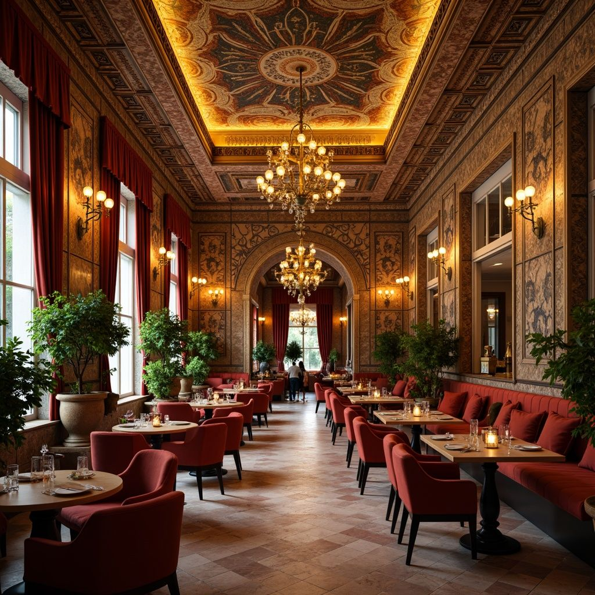
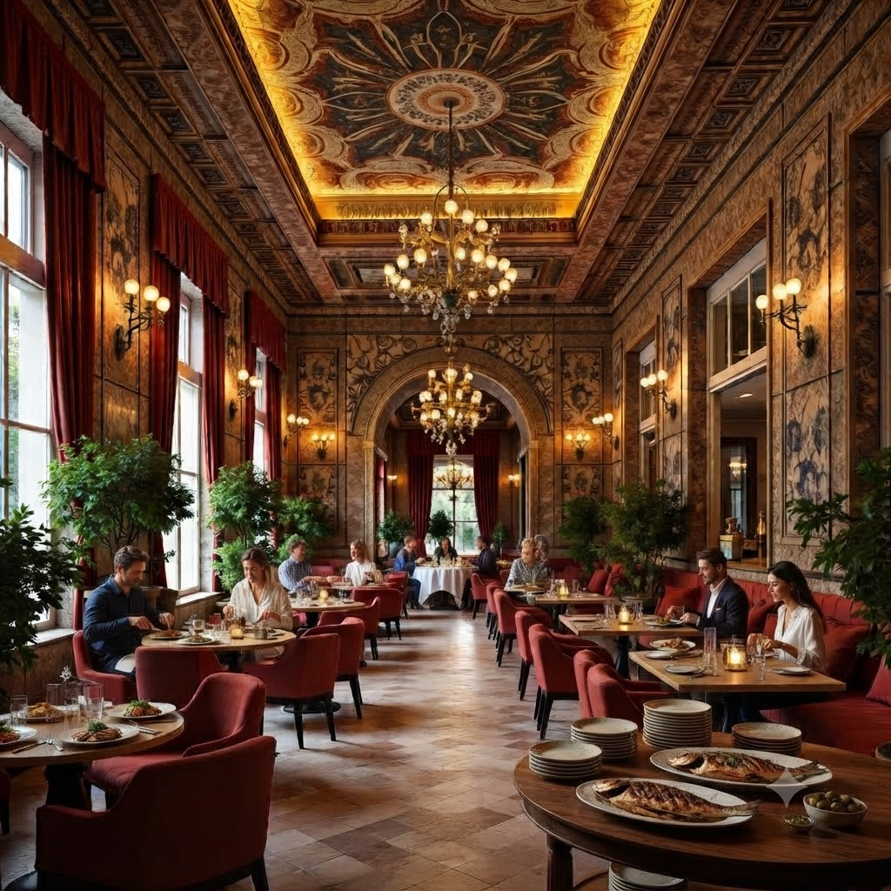
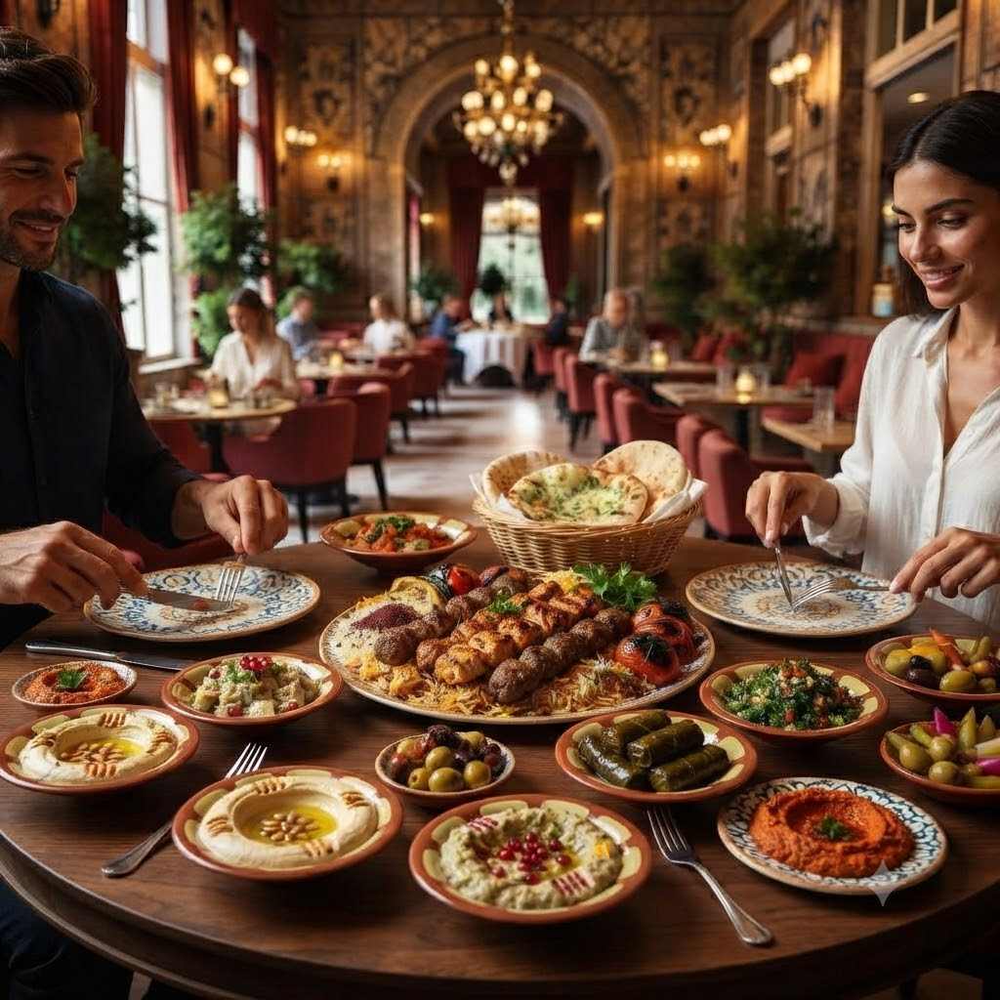
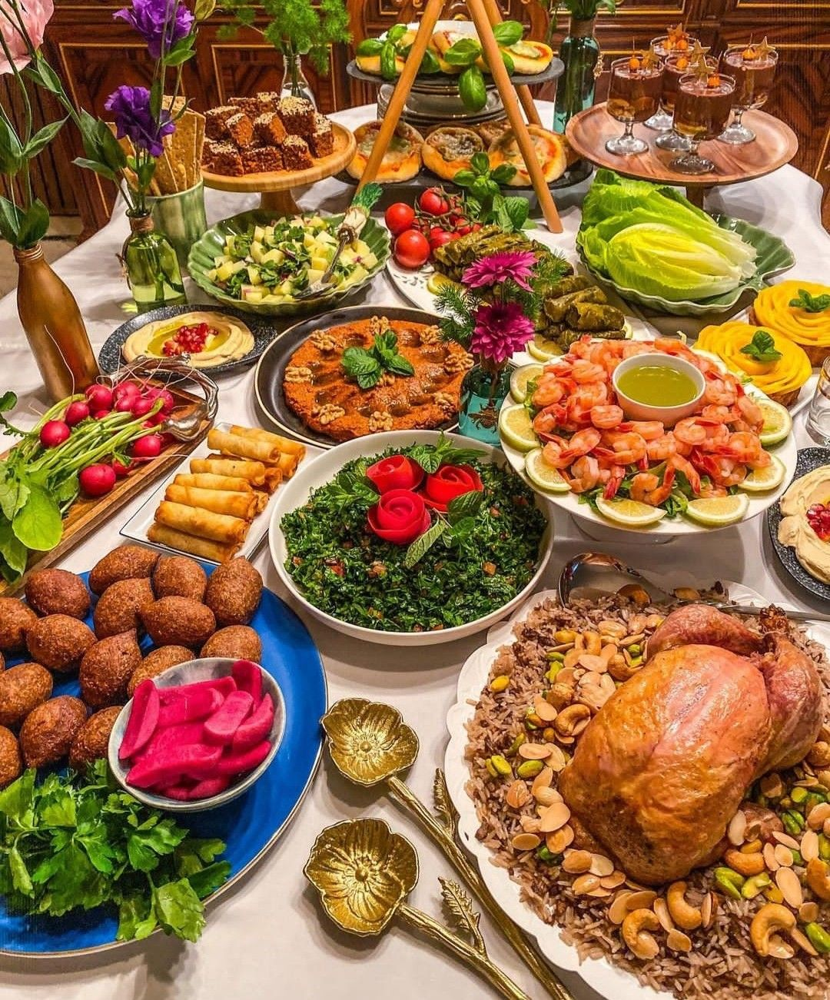

<!DOCTYPE html>
<html lang="en">
<head>
    <meta charset="UTF-8">
    <meta name="viewport" content="width=device-width, initial-scale=1.0">
    <meta name="description" content="Cedar House Restaurant authentic Lebanese cuisine in Milwaukee.">
    <meta name="keywords" content="Lebanese food, Cedar House Restaurant, Mediterranean cuisine">
    <title>Cedar House Restaurant</title>
    <link rel="stylesheet" href="main.css">
   <link rel="shortcut icon" href="images/favicon.png">
</head>
<body id="top">

    <a href="#top">Back to Top</a>

<header>
    
    <h1>Cedar House Restaurant</h1>
</header>
<nav>
<ul>
    <li><a href="index.html" class="active">Home</a></li>
    <li><a href="menu.html">Food Menu</a></li>
    <li><a href="drinks.html">Drinks</a></li>
    <li><a href="about.html">About</a></li>
    <li><a href="parties.html">Parties</a></li>
    <li><a href="order.html">Order</a></li>
    <li><a href="jobs.html">Jobs</a></li>
       <li><a href="contact.html">Contact</a></li>
</ul>
</nav>
<!-- Slideshow -->

<main>
<section>
<h2>Welcome to Our Table</h2>

Welcome to Cedar House, where the timeless traditions of Lebanese
hospitality meet the freshness of our kitchen. We are passionate about
sharing the rich flavors and culture of Lebanon through every meal we
prepare. From freshly made hummus and warm pita bread to perfectly grilled
kebabs and traditional desserts, every dish is crafted using authentic
recipes and high-quality ingredients. Whether you're joining us for a family
dinner, a special celebration, or a quick lunch with friends, our welcoming
atmosphere and friendly service will make you feel right at home. At Cedar
House, every meal is more than just food—it is a celebration of family,
tradition, and the unforgettable taste of Lebanese cuisine.

Every dish we serve is prepared with passion and authentic Lebanese flavors.
Our chefs carefully select fresh ingredients and follow traditional recipes
passed down through generations to create meals that represent the heart and
culture of Lebanon. From our homemade mezze and freshly baked bread to our
flavorful grilled specialties and signature desserts, every plate is crafted
with care to deliver a memorable dining experience. We take pride in bringing
family, friends, and our community together through delicious food and the
warm hospitality that Lebanon is known for.

<a href="about.html" class="button">
Learn More About Us
</a>
</section>
<section class="hours">
<h3>Opening Hours</h3>

Mon–Sun: 11:00 AM – 10:00 PM

</section>
</main>
<footer>
<h3>
Cedar House Restaurant
</h3>

456 Cedar Avenue 
Milwaukee, WI 53202 
<a href="tel:4145551234">
(414) 555-1234
</a>
 
<a href="mailto:info@cedarhouse.com">
info@cedarhouse.com
</a>

<a href="https://www.google.com/maps" target="_blank" rel="noopener">
Get Directions
</a>

    

    

© 2026 Cedar House Restaurant

</footer>
</body>
</html>