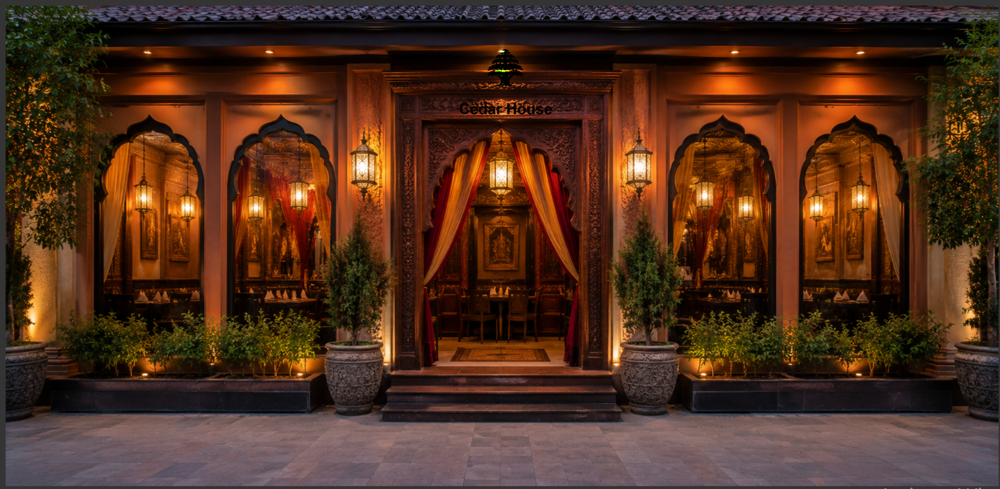

<!DOCTYPE html>
<html lang="en">
<head>
    <meta charset="UTF-8">
    <meta name="viewport" content="width=device-width, initial-scale=1.0">
    <meta name="description" content="Cedar House Restaurant authentic Lebanese cuisine in Milwaukee.">
    <meta name="keywords" content="Lebanese food, Cedar House Restaurant, Mediterranean cuisine">
    <title>Cedar House Restaurant</title>
    <link rel="stylesheet" href="main.css">
   <link rel="shortcut icon" href="images/favicon.png">
</head>
<body id="top">

    <a href="#top">Back to Top</a>

<header>
    
    <h1>Cedar House Restaurant</h1>
</header>
<nav>
<ul>
   <li><a href="index.html">Home</a></li>
    <li><a href="menu.html">Food Menu</a></li>
    <li><a href="drinks.html">Drinks</a></li>
    <li><a href="about.html" class="active">About</a></li>
    <li><a href="parties.html">Parties</a></li>
    <li><a href="order.html">Order</a></li>
    <li><a href="jobs.html">Jobs</a></li>
       <li><a href="contact.html">Contact</a></li>
</ul>
</nav>
    <main>
        <section>
            <h2>Our Story</h2>
            
                   <!-- New image added here with specific styling -->
           <figure>
    

    <figcaption style="font-style:italic; color:#666; text-align:center;">
        Welcome to Cedar House
    </figcaption>
</figure>
               

            At Cedar House, our journey began with a passion for sharing the authentic, 
            vibrant flavors of Lebanon. We believe that food is more than just nourishment; 
            it is a bridge that connects cultures and brings people together.
        

        

            From our kitchen to your table, we use traditional recipes passed down through 
            generations. Every ingredient is carefully selected to ensure that each dish 
            tells a story of heritage, family, and the warmth of Lebanese hospitality.
        

        

            We take immense pride in our commitment to quality, meticulously sourcing only 
            the freshest ingredients to ensure the integrity and authenticity of every recipe 
            we serve. Our dining space is crafted to be an extension of 
            our own home, blending elegant aesthetics with a warm, inviting atmosphere that 
            encourages lingering conversations and shared laughter among friends and family.
        

        

            Drawing from our professional backgrounds in providing technical and communication 
            support, as well as our experience in handling administrative tasks, we bring a 
            high level of precision and dedicated care to every aspect of your visit, ensuring 
            a seamless and memorable dining experience. Whether you are 
            visiting us for a quiet, intimate dinner or hosting a vibrant celebration, we 
            invite you to pull up a chair, experience the depth of Lebanese tradition, and 
            become a cherished part of our extended family here at Cedar House.
        

    </section>
</main>

   <footer>
<h3>
Cedar House Restaurant
</h3>

456 Cedar Avenue 
Milwaukee, WI 53202 
<a href="tel:4145551234">
(414) 555-1234
</a>
 
<a href="mailto:info@cedarhouse.com">
info@cedarhouse.com
</a>

<a href="https://www.google.com/maps" target="_blank" rel="noopener">
Get Directions
</a>

    

    

© 2026 Cedar House Restaurant

</footer>
</body>
</html>

