<!DOCTYPE html>
<html lang="en">
<head>
    <meta charset="UTF-8">
    <meta name="viewport" content="width=device-width, initial-scale=1.0">
    <meta name="description" content="Cedar House Restaurant authentic Lebanese cuisine in Milwaukee.">
    <meta name="keywords" content="Lebanese food, Cedar House Restaurant, Mediterranean cuisine">
    <title>Cedar House Restaurant</title>
    <link rel="stylesheet" href="main.css">
    <link rel="shortcut icon" href="images/favicon.png">
</head>
<body id="top">

    <a href="#top">Back to Top</a>

<header>
    
    <h1>Cedar House Restaurant</h1>
</header>
<nav>
<ul>
    <li><a href="index.html">Home</a></li>
    <li><a href="menu.html" class="active">Food Menu</a></li>
    <li><a href="drinks.html">Drinks</a></li>
    <li><a href="about.html">About</a></li>
    <li><a href="parties.html">Parties</a></li>
    <li><a href="order.html">Order</a></li>
    <li><a href="jobs.html">Jobs</a></li>
    <li><a href="contact.html">Contact</a></li>
</ul>
</nav>

<main>
    

        <h2>Our Menu</h2>
    

    

        <!-- Radio inputs -->
        <input type="radio" name="menu-tabs" id="food-tab1" class="tab-input" checked>
        <input type="radio" name="menu-tabs" id="food-tab2" class="tab-input">
        <input type="radio" name="menu-tabs" id="food-tab3" class="tab-input">
        <input type="radio" name="menu-tabs" id="food-tab4" class="tab-input">

        <!-- Tab clickable labels -->
        

            <label for="food-tab1">Appetizers & Mezzes</label>
            <label for="food-tab2">Soup</label>
            <label for="food-tab3">Main Courses</label>
            <label for="food-tab4">Sweet</label>
        

        <!-- ================= APPETIZERS ================= -->
        <section id="appetizers" class="menu-section">
            <h2>Appetizers & Mezzes</h2>

            

                

                    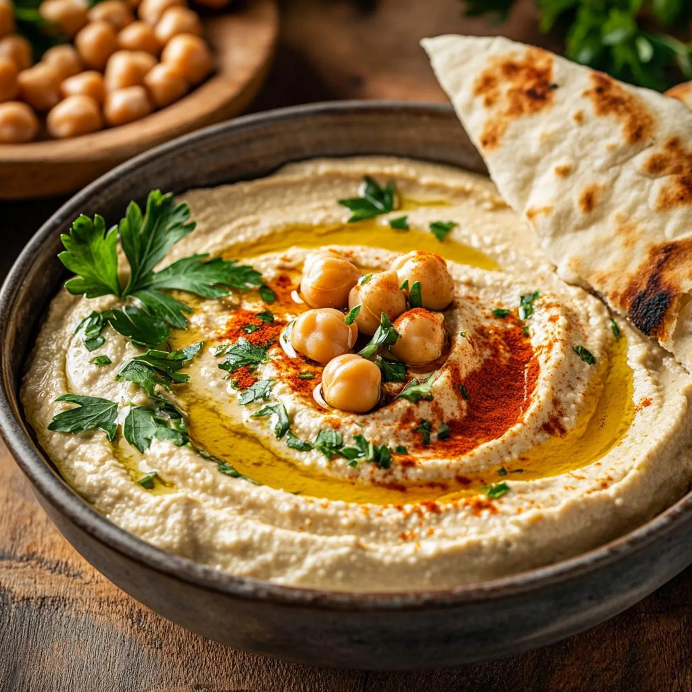
                    

                        <h3>Hummus</h3>
                        
Creamy chickpea puree with tahini, lemon, and garlic, drizzled with olive oil.

                        <ul class="price-options">
                            <li>Per plate: $9.00</li>
                        </ul>
                    

                

                

                    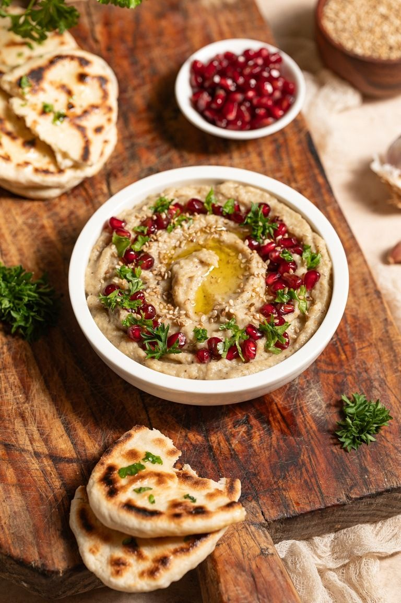
                    

                        <h3>Baba Ghanoush</h3>
                        
Roasted eggplant dip with tahini, lemon, and pomegranate molasses.

                        <ul class="price-options">
                            <li>Per plate: $9.00</li>
                        </ul>
                    

                

                

                    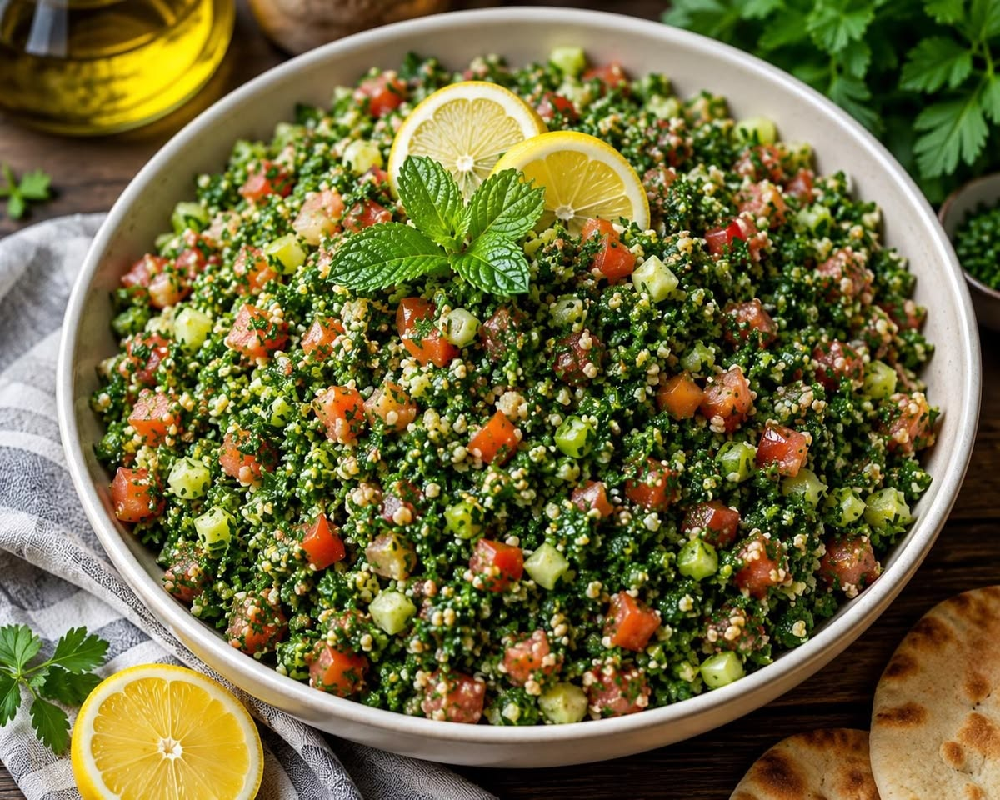
                    

                        <h3>Tabbouleh</h3>
                        
Fresh parsley salad with cracked wheat (bulgur), tomatoes, onions, mint, and a lemon-oil dressing.

                        <ul class="price-options">
                            <li>Per plate: $10.00</li>
                        </ul>
                    

                

                

                    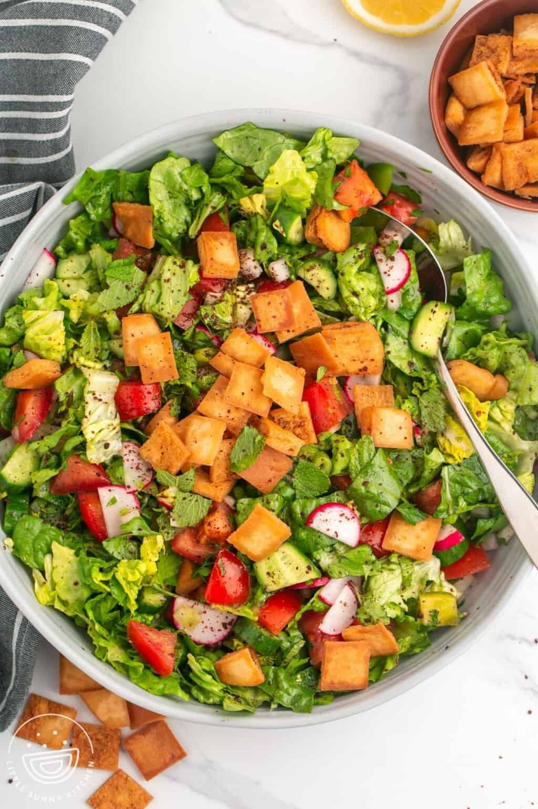
                    

                        <h3>Fattoush</h3>
                        
A vibrant salad of mixed greens, radishes, tomatoes, and cucumbers, topped with crispy pita and sumac dressing.

                        <ul class="price-options">
                            <li>Per plate: $10.00</li>
                        </ul>
                    

                

                

                    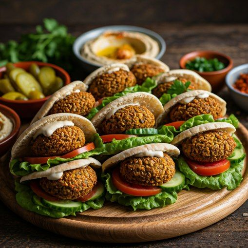
                    

                        <h3>Falafel</h3>
                        
Crispy chickpea fritters served with tahini sauce.

                        <ul class="price-options">
                            <li>12 pieces: $8.00</li>
                        </ul>
                    

                

                

                    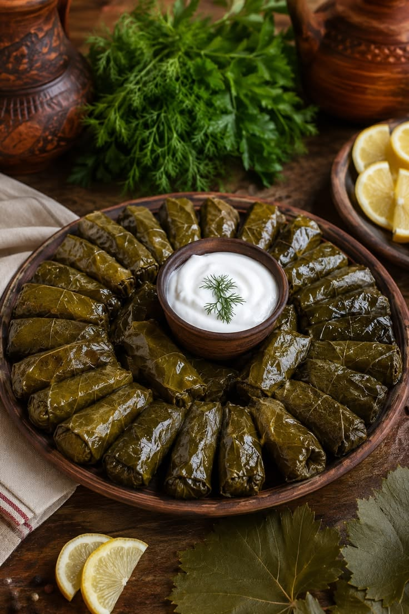
                    

                        <h3>Grape Leaves</h3>
                        
Tender grape leaves stuffed with rice, herbs, and spices.

                        <ul class="price-options">
                            <li>Per plate: $9.00</li>
                        </ul>
                    

                

                

                    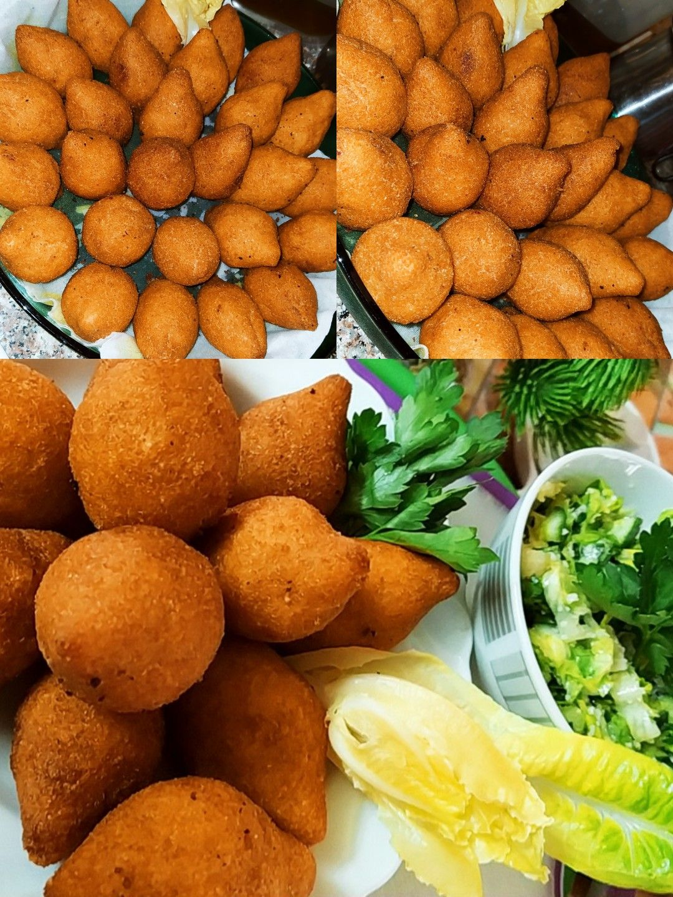
                    

                        <h3>Kibbeh</h3>
                        
Deep-fried shell-shaped croquettes of bulgur and minced lamb, filled with sautéed onions and pine nuts.

                        <ul class="price-options">
                            <li>1 piece: $2.00</li>
                            <li>6 pieces: $10.00</li>
                        </ul>
                    

                

                

                    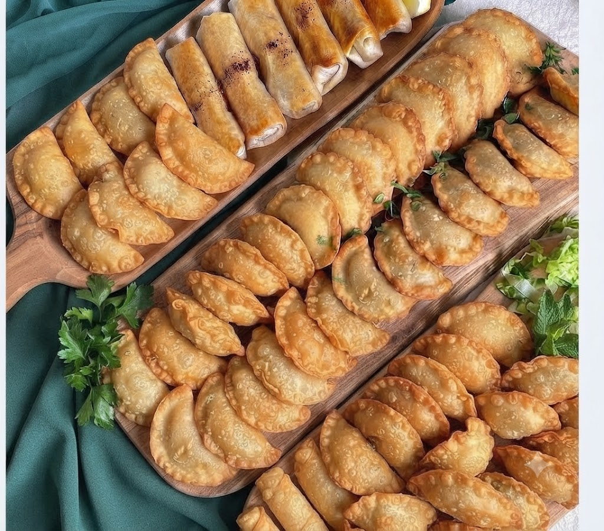
                    

                        <h3>Sambousek</h3>
                        
Small, golden-brown savory pastries filled with spiced minced meat or cheese.

                        <ul class="price-options">
                            <li>Each 15 pieces: $10.00</li>
                            <li>2 pieces: $2.00</li>
                        </ul>
                    

                

            

        </section>

        <!-- ================= SOUP ================= -->
        <section id="soup" class="menu-section">
            <h2>Soup</h2>

            

                

                    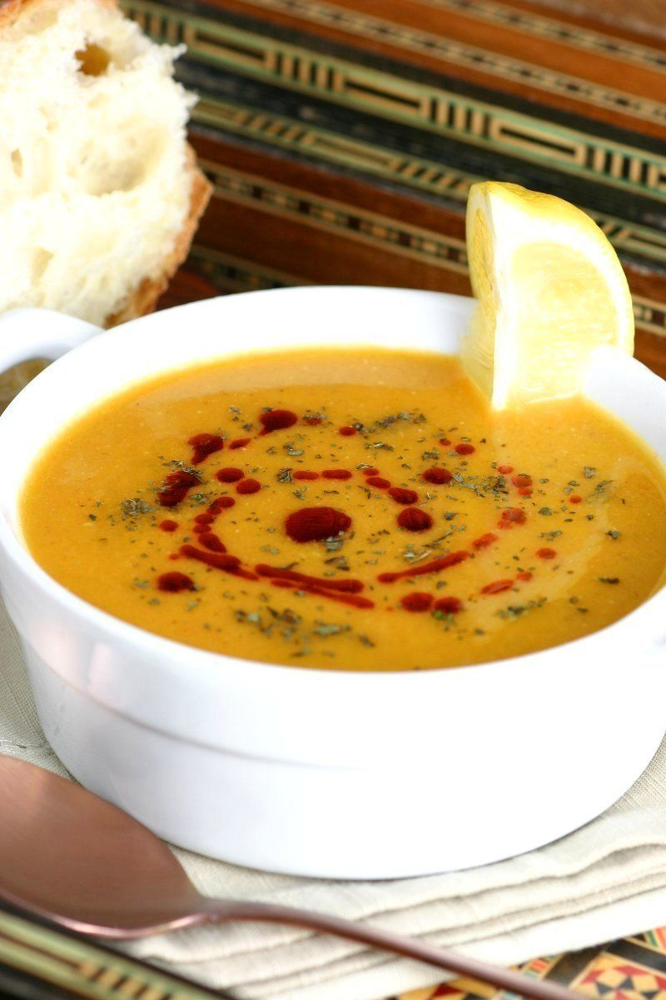
                    

                        <h3>Lentil Soup (Shorbat Adas)</h3>
                        
A smooth, comforting yellow lentil soup flavored with cumin, turmeric, garlic, lemon, and crispy pita croutons.

                        <ul class="price-options">
                            <li>Per bowl: $6.00</li>
                        </ul>
                    

                

                

                    
                    

                        <h3>Vermicelli Chicken Soup (Shorbat Sh'arieh)</h3>
                        
A light chicken broth prepared with vermicelli noodles and shredded chicken.

                        <ul class="price-options">
                            <li>Per bowl: $7.00</li>
                        </ul>
                    

                

                

                    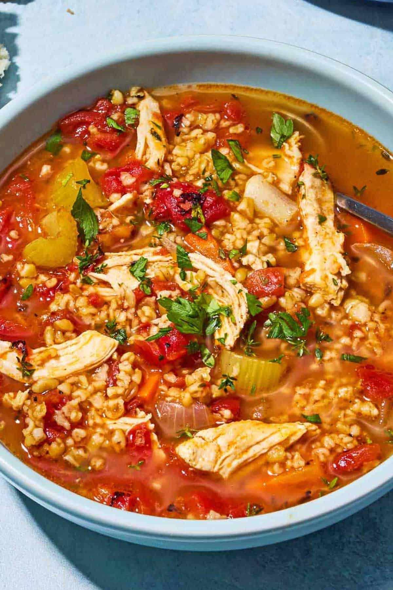
                    

                        <h3>Freekeh Soup</h3>
                        
A hearty soup made from roasted green wheat (freekeh), cooked with chicken or lamb broth.

                        <ul class="price-options">
                            <li>Per bowl: $8.00</li>
                        </ul>
                    

                

                

                    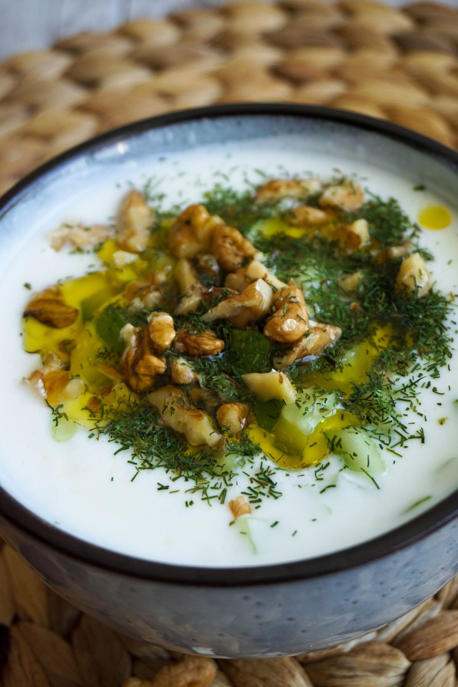
                    

                        <h3>Yogurt Soup (Shurbat Laban)</h3>
                        
A creamy yogurt soup flavored with dried mint, garlic, and sometimes meatballs or rice.

                        <ul class="price-options">
                            <li>Per bowl: $8.00</li>
                        </ul>
                    

                

                

                    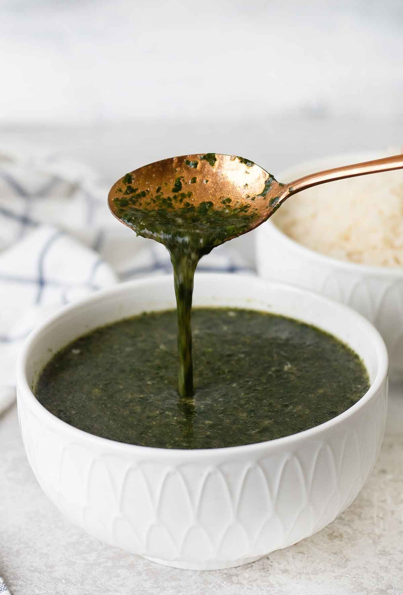
                    

                        <h3>Molokhia Soup</h3>
                        
Traditional green soup made from molokhia leaves with garlic, coriander, and chicken broth.

                        <ul class="price-options">
                            <li>Per bowl: $9.00</li>
                        </ul>
                    

                

            

        </section>

        <!-- ================= MAIN COURSES ================= -->
        <section id="main-courses" class="menu-section">
            <h2>Main Courses</h2>

            

                

                    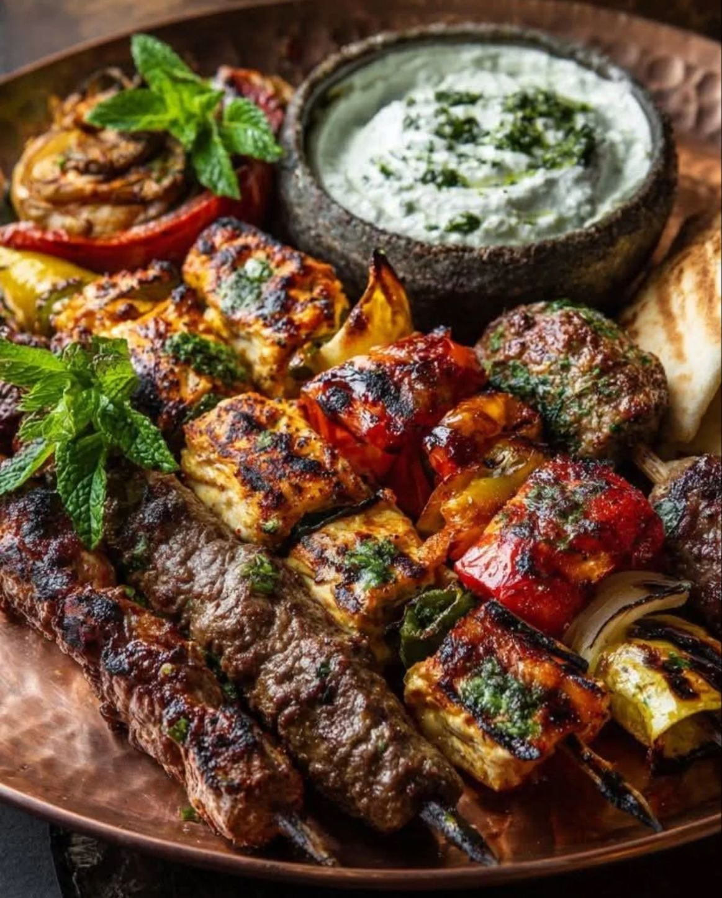
                    

                        <h3>Mixed Grill Platter</h3>
                        
A premium assortment of charcoal-grilled meat skewers, including tender lamb and chicken, served with fresh herbs, grilled vegetables, and a side of creamy dip.

                        <ul class="price-options">
                            <li>Price: $22.00</li>
                        </ul>
                    

                

                

                    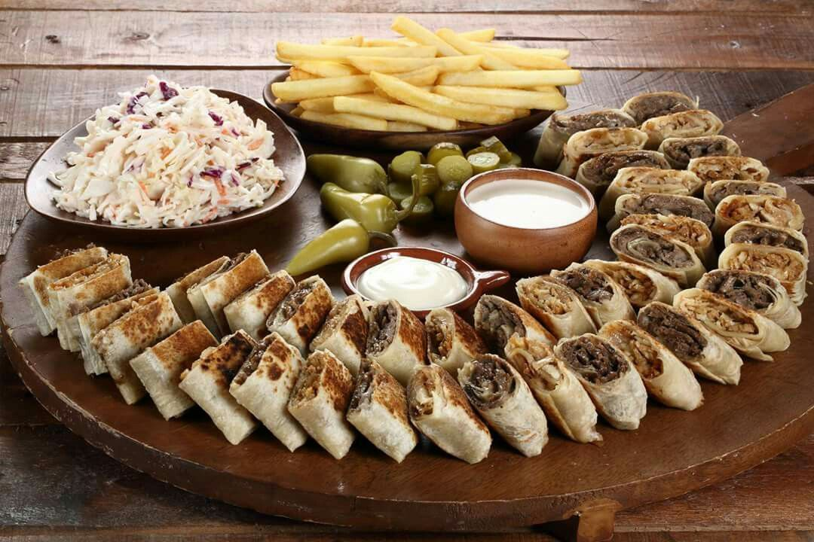
                    

                        <h3>Meat Shish Tawook Platter</h3>
                        
A generous serving of grilled meat skewers, accompanied by mini-wraps, crispy fries, coleslaw, and dipping sauces.

                        <ul class="price-options">
                            <li>Price: $19.00</li>
                        </ul>
                    

                

                

                    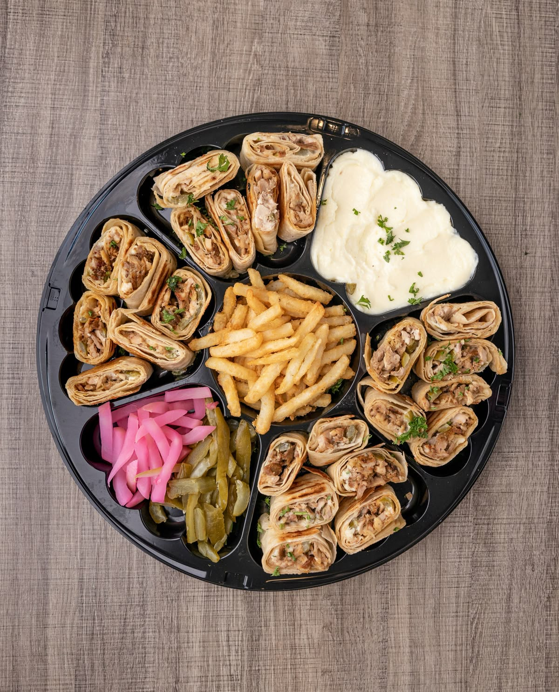
                    

                        <h3>Chicken Shish Tawook Platter</h3>
                        
A delicious platter featuring chicken shawarma wraps, crispy fries, pickles, pickled turnips, and creamy garlic sauce.

                        <ul class="price-options">
                            <li>Price: $18.00</li>
                        </ul>
                    

                

                

                    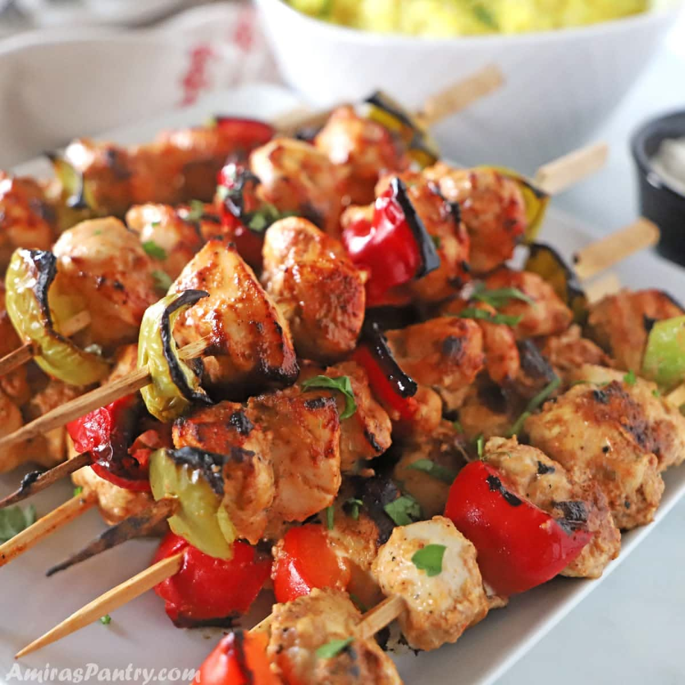
                    

                        <h3>Chicken Tawook</h3>
                        
Succulent marinated chicken skewers grilled with bell peppers and onions.

                        <ul class="price-options">
                            <li>Price: $15.00</li>
                        </ul>
                    

                

                

                    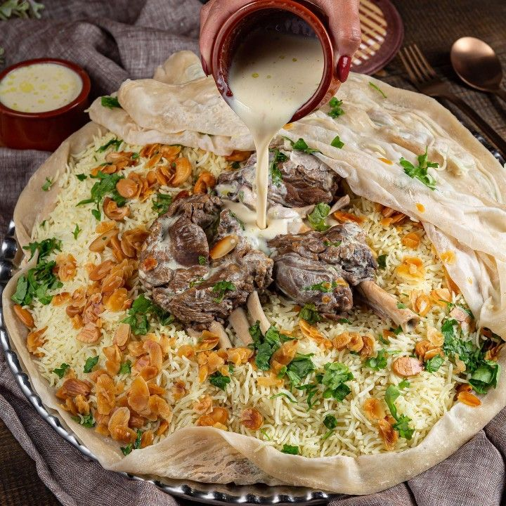
                    

                        <h3>Lamb Mansaf</h3>
                        
Traditional Jordanian dish featuring tender slow-cooked lamb served with rice, flatbread, jameed sauce, and toasted nuts.

                        <ul class="price-options">
                            <li>Price: $24.00</li>
                        </ul>
                    

                

                

                    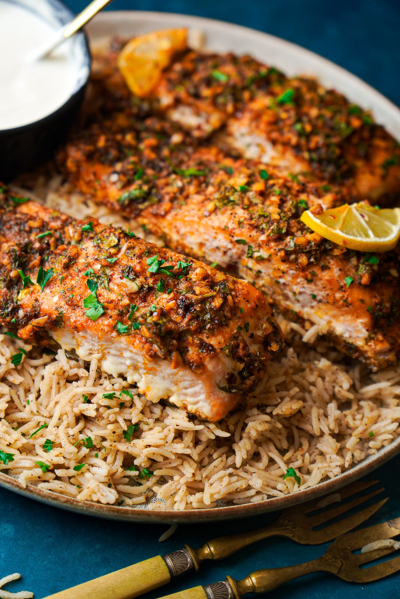
                    

                        <h3>Fish Sayadieh</h3>
                        
Spiced fish fillets served over aromatic rice cooked with caramelized onions and toasted nuts.

                        <ul class="price-options">
                            <li>Price: $18.00</li>
                        </ul>
                    

                

                

                    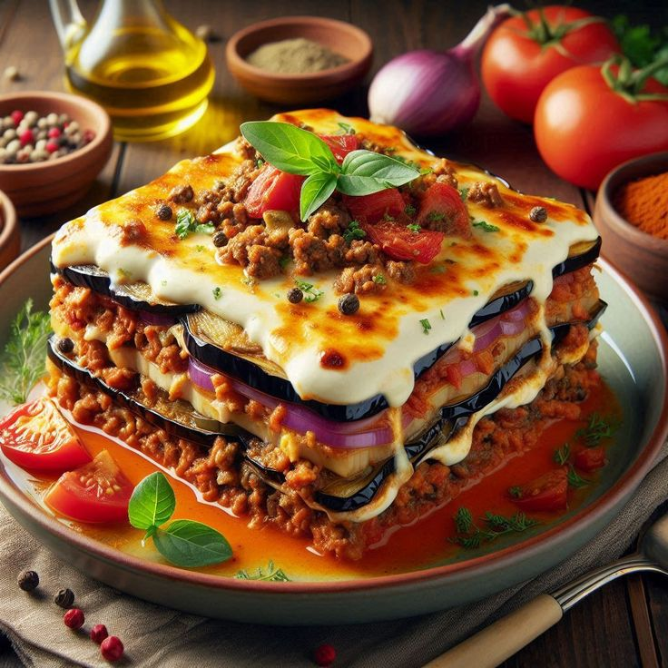
                    

                        <h3>Mousaka</h3>
                        
A layered casserole with roasted eggplant, seasoned meat, tomato sauce, and creamy béchamel topping.

                        <ul class="price-options">
                            <li>Price: $17.00</li>
                        </ul>
                    

                

                

                    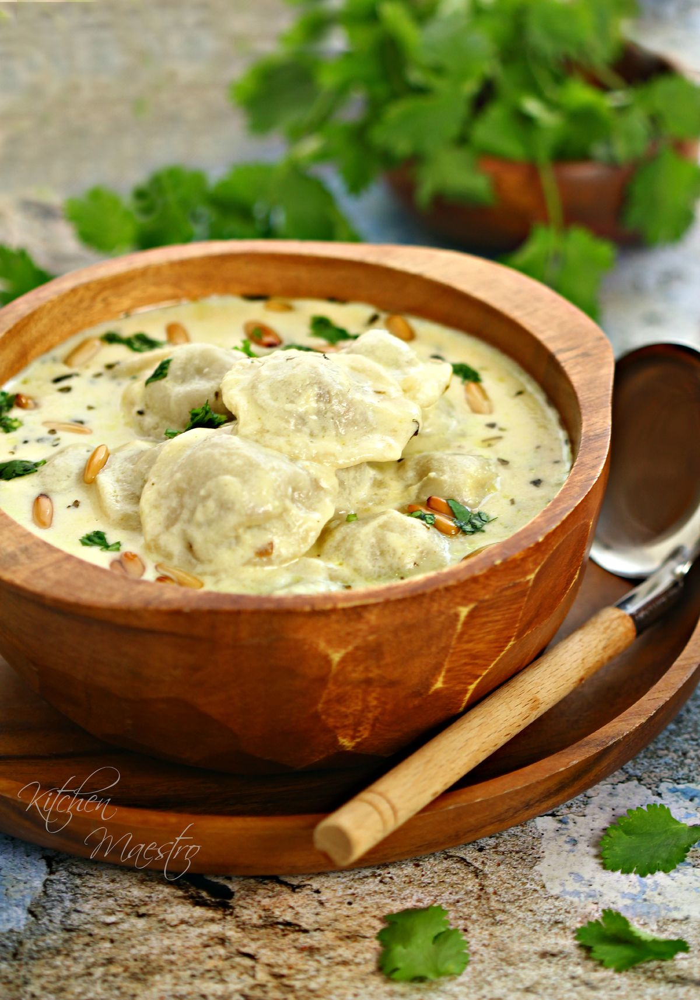
                    

                        <h3>Shish Barak</h3>
                        
Tender meat dumplings cooked in creamy garlic yogurt sauce with herbs and pine nuts.

                        <ul class="price-options">
                            <li>Price: $16.00</li>
                        </ul>
                    

                

                

                    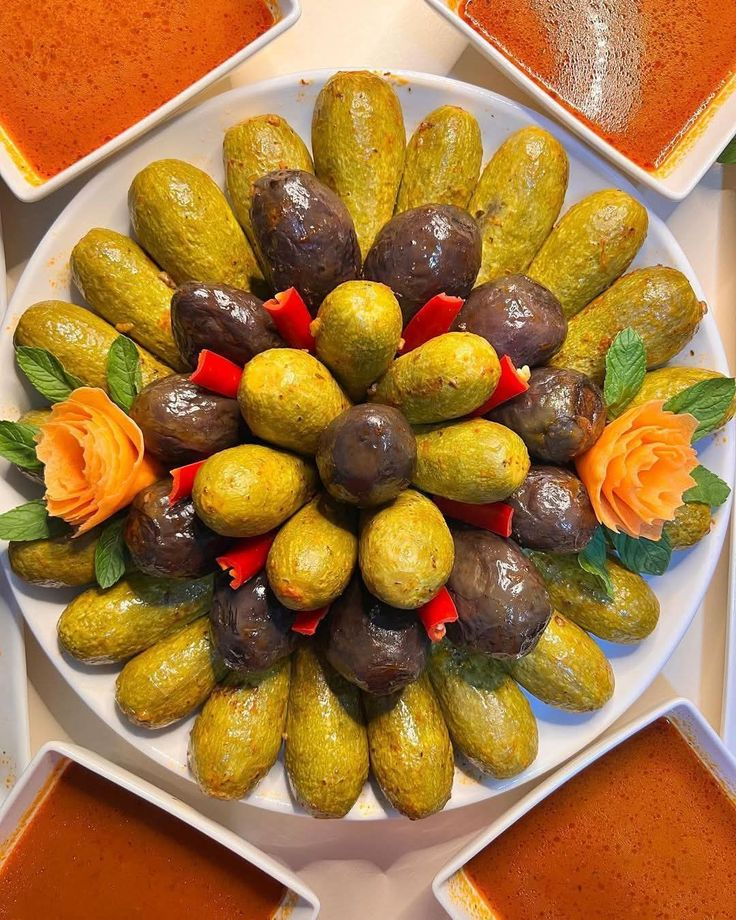
                    

                        <h3>Kousa Mahshi</h3>
                        
Stuffed zucchini filled with rice and minced meat, slow cooked in a rich tomato broth.

                        <ul class="price-options">
                            <li>Price: $16.00</li>
                        </ul>
                    

                

            

        </section>

        <!-- ================= SWEET ================= -->
        <section id="sweet" class="menu-section">
            <h2>Sweet</h2>

            

                

                    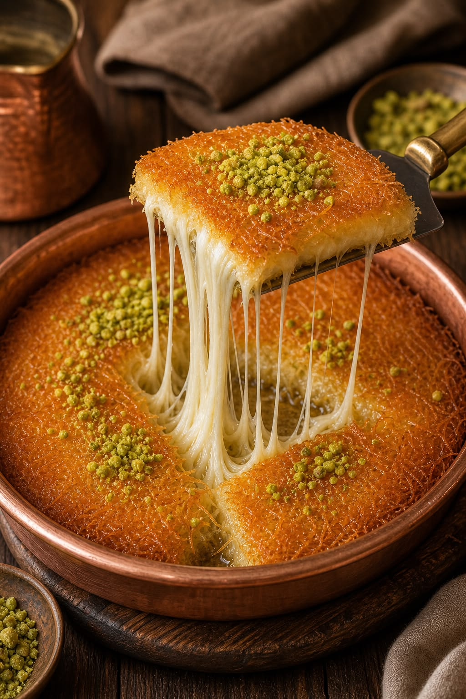
                    

                        <h3>Kunafa</h3>
                        
Crispy shredded phyllo dough layered with sweet cheese or cream, rose syrup, and pistachios.

                        <ul class="price-options">
                            <li>Price per piece: $9.00</li>
                        </ul>
                    

                

                

                    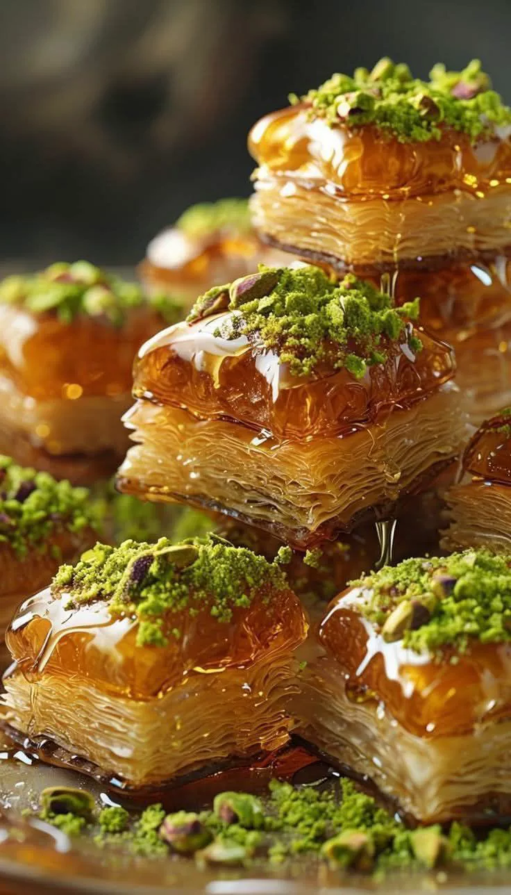
                    

                        <h3>Baklava</h3>
                        
Layers of buttery phyllo pastry filled with chopped nuts and sweet syrup.

                        <ul class="price-options">
                            <li>Price per piece: $2.50</li>
                        </ul>
                    

                

                

                    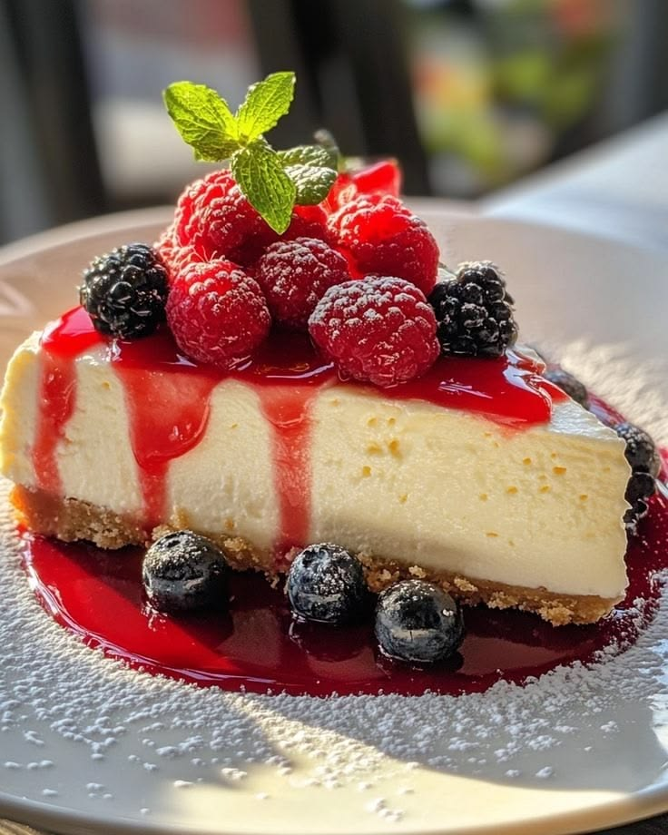
                    

                        <h3>Strawberry Cheesecake</h3>
                        
Creamy cheesecake with a buttery crust and fresh strawberry topping.

                        <ul class="price-options">
                            <li>Price per piece: $8.50</li>
                        </ul>
                    

                

                

                    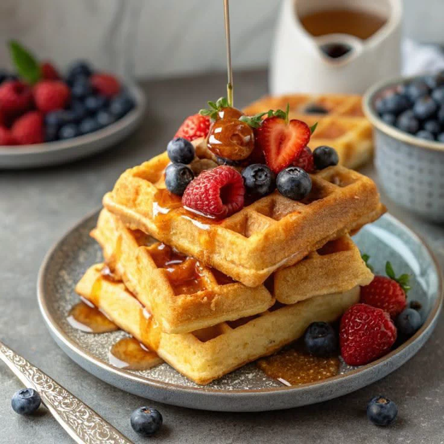
                    

                        <h3>Waffles</h3>
                        
Crispy golden waffles served warm with chocolate drizzle, berries, or whipped cream.

                        <ul class="price-options">
                            <li>Price per piece: $7.50</li>
                        </ul>
                    

                

            

        </section>
    

</main>

<footer>
<h3>
Cedar House Restaurant
</h3>

456 Cedar Avenue 
Milwaukee, WI 53202 
<a href="tel:4145551234">
(414) 555-1234
</a>
 
<a href="mailto:info@cedarhouse.com">
info@cedarhouse.com
</a>

<a href="https://www.google.com/maps" target="_blank" rel="noopener">
Get Directions
</a>

    
    

© 2026 Cedar House Restaurant

</footer>
</body>
</html>