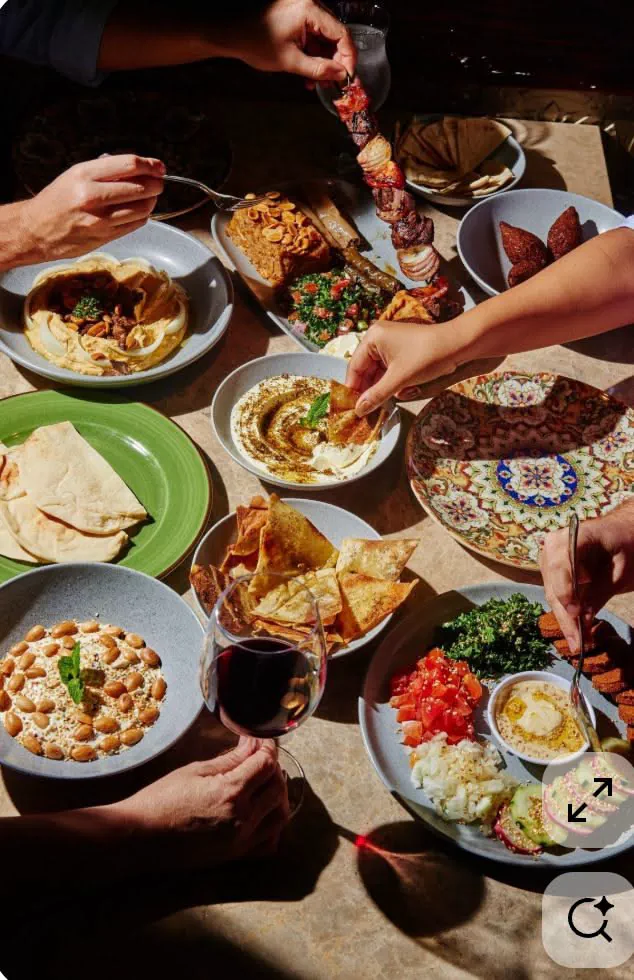

<!DOCTYPE html>
<html lang="en">
<head>
    <meta charset="UTF-8">
    <meta name="viewport" content="width=device-width, initial-scale=1.0">
    <meta name="description" content="Cedar House Restaurant authentic Lebanese cuisine in Milwaukee.">
    <meta name="keywords" content="Lebanese food, Cedar House Restaurant, Mediterranean cuisine">
    <title>Cedar House Restaurant</title>
    <link rel="stylesheet" href="main.css">
   <link rel="shortcut icon" href="images/favicon.png">
</head>
<body id="top">

    <a href="#top">Back to Top</a>

<header>
    
    <h1>Cedar House Restaurant</h1>
</header>
<nav>
<ul>
   <li><a href="index.html">Home</a></li>
    <li><a href="menu.html">Food Menu</a></li>
    <li><a href="drinks.html">Drinks</a></li>
    <li><a href="about.html">About</a></li>
    <li><a href="parties.html"class="active">Parties</a></li>
    <li><a href="order.html">Order</a></li>
    <li><a href="jobs.html">Jobs</a></li>
       <li><a href="contact.html">Contact</a></li>
</ul>
</nav>

    <main>

        

            <section class="event-intro">

                <h2>Private Events & Group Dining</h2>

                

                    Host your next milestone at Cedar House. Whether an intimate
                    gathering, a corporate function, or a celebratory occasion,
                    our dedicated events team ensures every detail is meticulously
                    curated. Please provide your event particulars below, and we
                    will contact you to begin crafting a bespoke experience.
                

            </section>

    

    

            <form class="event-form" action="/submit-event" method="POST">

                <fieldset>

                    <legend>Guest Information</legend>

                    <input type="text"
                           name="full_name"
                           placeholder="Full Name"
                           required>

                    <input type="tel"
                           name="phone"
                           placeholder="Phone Number"
                           required>

                    <input type="email"
                           name="email"
                           placeholder="Email Address"
                           required>

                </fieldset>

                <fieldset>

                    <legend>Event Specifications</legend>

                    <input type="number"
                           name="guest_count"
                           placeholder="Number of Guests"
                           required>

                    <input type="date"
                           name="event_date"
                           required>

                    <select name="occasion">

                        <option value="" disabled selected>
                            Select Occasion
                        </option>

                        <option value="birthday">
                            Birthday Celebration
                        </option>

                        <option value="corporate">
                            Corporate Function
                        </option>

                        <option value="shower">
                            Baby/Bridal Shower
                        </option>

                    </select>

                    <textarea name="requests"
                              placeholder="Special Requests or Dietary Requirements..."></textarea>

                </fieldset>

                <button type="submit" class="btn-primary">
                    Submit Inquiry
                </button>

            </form>

        

    </main>

<footer>
<h3>
Cedar House Restaurant
</h3>

456 Cedar Avenue 
Milwaukee, WI 53202 
<a href="tel:4145551234">
(414) 555-1234
</a>
 
<a href="mailto:info@cedarhouse.com">
info@cedarhouse.com
</a>

<a href="https://www.google.com/maps" target="_blank" rel="noopener">
Get Directions
</a>

    

    

© 2026 Cedar House Restaurant

</footer>
</body>
</html>